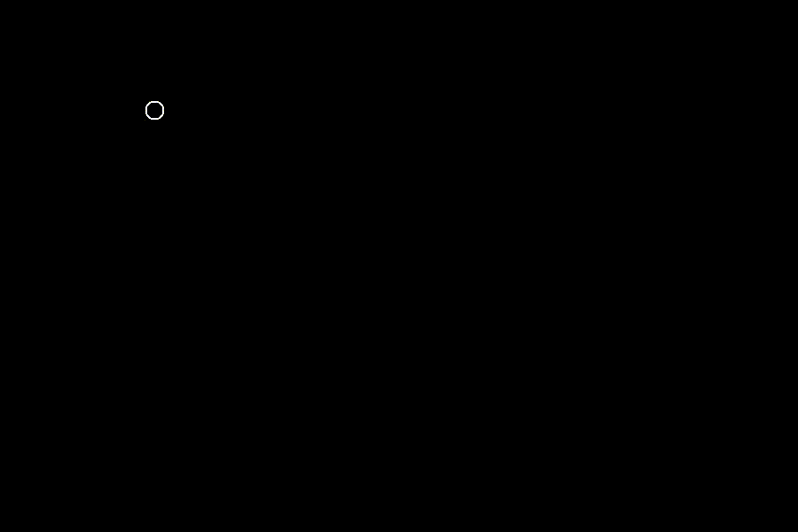
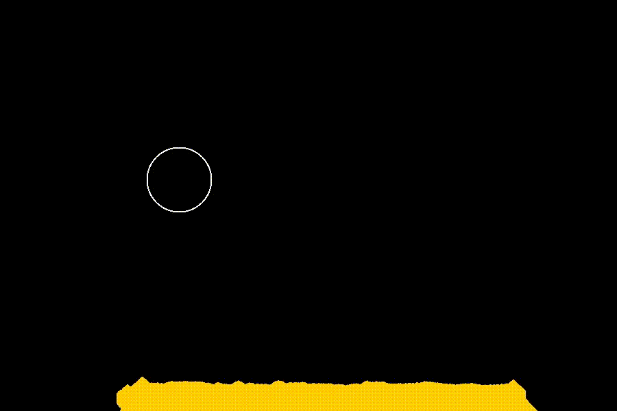

# sandy
---
A simple sand simulator I made to learn about graphics programming in C with SDL3


## Dependencies
- SDL3
- GNU Make

## Build
```make```

## Run
```./sandy```

## Features
- Terribly inefficient software rendering
- Left Click to add sand

- Right Click to remove sand

- Scroll to change the size of your cursor


## Docs
Not much here at the moment, I'll explain the #defines at the top that are useful:
- **WIDTH** and **HEIGHT** define the window size
- **FPS** defines the target FPS, the simulation will run at that framerate at the FASTEST
- **DEFAULT_BLOB_RADIUS** sets the initial value for the radius of the cursor
- **MIN_BLOB_RADIUS** defines the minimum value for the radius of the cursor (I have no idea what happens if the cursor radius is negative)
- **MAX_BLOB_RADIUS** same thing but the max
- **CURSOR_THICKNESS** the thickness of the circle representing your cursor
